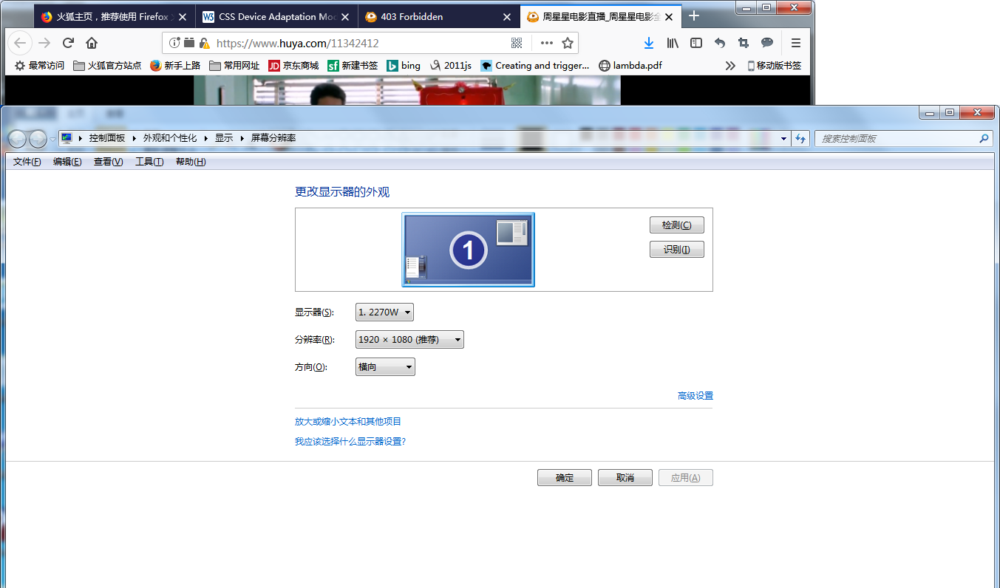
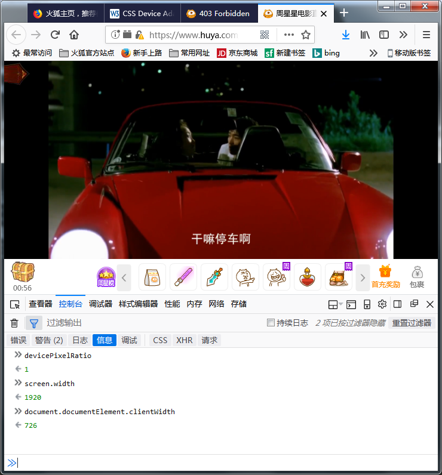
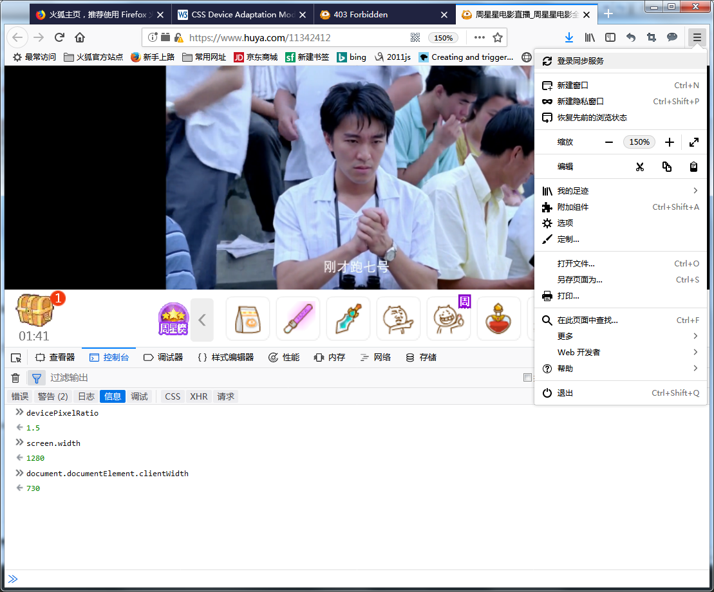
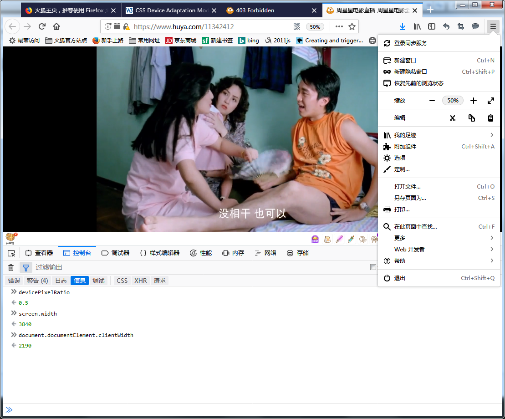
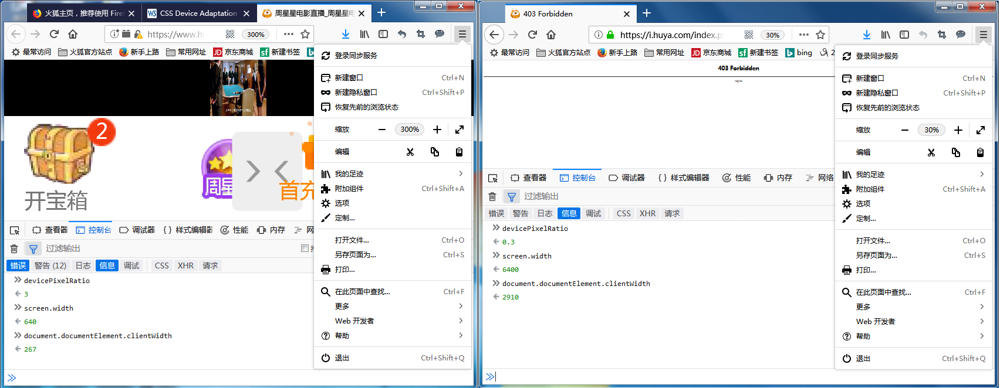

> 2018年6月12日
css2.1
2.3 css2.1 processing model
this is only a conceptual model.
1. document tree
2. media type
3. retrieve all style sheets associated with media type
4. annotate every element of the document tree by assigning a single value to every property (applicable)
*cascading and inhritance*
part of the caculation depends on the formatting algorithm.(screen -> visual formatting model)
5. from the annotated document tree, generate a formatting struture.
6. Transfer the formatting structure to the target medium.
2.3.1 The canvas
For all media, the term canvas describes "the space where the formatting structure is rendered." the canvas is infinite of each dimension of the space, but rendering generally occurs in a finite region of the canvas, established by the user agent according to the target medium.

9.1.1 The viewport
User agents for continuous media generally offer users a viewport(a window or other viewing area on the screen) through which users cousult a document.

10.1 Definition of "containing block"
1. The containing block in which the root element lives is a rectangle called the initial containing block.For continuous media, it has the dimensions of the viewport and is anchored at the canvas origin;...

/*
**
**
**
*/
CSS Device Adaptation Module Level 1
W3C Working Draft, 29 March 2016

This specification provides a way for an author to specify, in CSS, the size, zoom factor, and orientation of the viewport that is used as the base for the initial containing block.

1. introduction
...
The narrow viewport is a problem for documents designed to look good in desktop browsers. The result is that mobile browser vendors use a fixed initial containing block size that is different from the viewport size, and close to that of a typical desktop browser window. In addition to scrolling or panning, zooming is often used to change between an overview of the document and zoom in on particular areas of the document to read and interact with.
###ps：what dose this sentence “use a fixed initial containing block size”
means ?

Certain DOCTYPEs (for instance XHTML Mobile Profile) are used to recognize mobile documents which are assumed to be designed for handheld devices, hence using the viewport size as the initial containing block size......
###ps：https://en.wikipedia.org/wiki/XHTML_Mobile_Profile

Additionally, an HTML <META> tag has been introduced for allowing an author to specify the size of the initial containing block, and the initial zoom factor directly......

3.The viewport
initial viewport
actual viewport

/*
**
**
*/
正文：
我们主要讨论，media screen。（page，speech不管）。
从css2.3，2.3.1我们可以认为（当然你也可以不这么认为），有一个无穷大的canvas（不同于html canvas元素），我们可以把内容渲染到上面（当然这么说也不准确。）当UA来渲染到screen上的时候，会使用有限区域。它肯定不能真的弄到无穷大，（莫非你想用js把页面尺度弄到infinity）。管他呢，我们只考虑用有限的区域。那么宽，高怎么确定？从9.1.1，10.1中的1，我们得知我们需要从ICB开始渲染工作，ICB的尺寸是由viewport确定的（或者是相关的，不排除某些UA有其他做法）。

下面我们在具体例子中，用图来解释阐述。

显示器AOC E2270Sw，Display Area 476.64 (H)×268 (V)mm
我使用的分辨率1920*1080（操作系统来看，就是1920*1080逻辑像素映射到物理像素。
从浏览器来看，可以认为自己所在的操作系统上，设备物理像素1920*1080）。
Firefox Quantum 60.0.2(64位)
见

我们先打开一个网页
见
然后我们调整浏览器窗口大小
见

看下面这个页面，然后我们对其页面进行缩放

再看看

什么是viewport，就是我们图中，浏览器的中间显示页面那一块。对，就是那里。不含各种栏。那它的尺寸呢？只打出了document.documentElement.clientWidth，（忘了clientHeight了，哈哈）。图二、三，调整窗口大小，viewport变了。见document.documentElement.clientWidth。如果手机上面，你能把浏览器窗口拉大拉小，那么viewport也是会变的。

window.devicePixelRatio = PX（物理像素数） / px（设备独立像素）
观察三个参数
devicePixelRatio, screen.width, document.documentElement.clientWidth
注意这些的尺寸，都是dip。我们说的都是css里面的px。//2018年6月13日16:04:06 oh，no
图四，我们进行了缩放，
（一）100%，devicePixelRatio=1，  screen.width=1920, css一个px宽度用一个物理像素宽度显示
（二）150%，devicePixelRatio=1.5，screen.width=1280, css一个px宽度用一点五个物理像素宽度显示
（三）200%，devicePixelRatio=2,   screen.width=960,  css一个px宽度用二个物理像素宽度显示
（四）50%，devicePixelRatio=0.5，screen.width=3840, css一个px宽度用0.5个物理像素宽度显示

（X*Y)就是X方向和Y方向的缩放。
根据之前，显示器476.64 (H)×268 (V)mm，1920*1080

476.64mm/1920=0.24825mm
268mm/1080=0.248(148)mm
可以认为我这里物理像素点是长宽一样。 （0.248mm * 0.248 mm）

在UA运行的时候，显示器物理分辨率1980PX*1080PX，它无法改变；缩放是由用户来调整，也就是说从外部调整了devicePixelRatio（手机浏览器一般会设置）。这样的结果是：对UA来说，PX固定，devicePixelRatio固定，它仅仅得到的screen.width而已。

再看图五，我们同时开两个页面。
d=3，screen.width=640 （这个页面会说，我草，显示器宽度才640px）
d=0.3，screen.width=6400 （这个页面会说，我去，显示器宽度居然有6400px）
它们两个都是在同一个显示器上（宽度1980PX），d不同，页面得到的不同的px。就是UA得到的（自己认为的）设备显示器的px。从devicePixelRatio=PX/px，设备独立像素（px）也并不是独立的，px和PX之间存在映射关系。

我们的浏览器打开一个页面的时候，它会得到screen.width。（一般pc浏览器，d=1，screen.width = device.width，一个px宽度用一个PX宽度显示。如果某个手机d=2, screen.width=device.width/2，一个px宽度用两个PX宽度显示。）同时它的窗口有个显示区域，根据这个区域占据显示屏的比例，等比例的从screen.width，screen.height算出viewport大小。这些数据都是px，也就是css用的。拿到这些数据，我们就跑去canvas干活了。对，就是那个无穷大的canvas。而我们只需要有限大小。根据viewport，我们弄个ICB，然后根据盒子模型往里面画盒子，把大大小小的盒子都根据文档画好。注意，这一切都是在canvas上弄的，单位px。根据d，再把这个渲染的页面显示到显示屏上。

我们用UA打开一个页面的时候，那一刻我们有 UA.ClienArea.width, UA.ClientArea.height，再加上device.width，device.height，可以说我们处于PX的世界。UA只需要查看一个devicePixelRatio，就能算出screen.width，scree.height，document.documentElement.clientWidth， document.documentElement.clientHeight，为进入px的世界做好准备。

div {width:1cm; height:1cm;} 怎么换算呢？

2018年6月13日
就像TeX中单位计算换算成sp，px也是css中的canonical unit，其他单位也需要换算成px。

**************************************************
Device-independent pixel
(https://en.wikipedia.org/wiki/Device-independent_pixel)
A device-independent pixel (also: density-independent pixel, dip, dp) is a physical unit of measurement based on a coordinate system held by a computer and represents an abstraction of a pixel for use by an application that an underlying system then converts to physical pixels.

A typical use is to allow mobile device software to scale the display of information and user interaction to different screen sizes. The abstraction allows an application to work in pixels as a measurement, while the underlying graphics system converts the abstract pixel measurements of the application into real pixel measurements appropriate to the particular device. For example, on the Android operating system a device-independent pixel is equivalent to one physical pixel on a 160 dpi screen,[1] while the Windows Presentation Foundation specifies one device-independent pixel as equivalent to 1/96th of an inch.[2]

As dp is a physical unit it has an absolute value which can be measured in traditional units, e.g. for Android devices 1 dp equals 1/160 of inch or 0.15875 mm.

While traditional pixels only refer to the display of information, device-independent pixels may also be used to measure user input such as input on a touch screen device.

********************************************
density
added in API level 1

public float density

The logical density of the display. This is a scaling factor for the Density Independent Pixel unit, where one DIP is one pixel on an approximately 160 dpi screen (for example a 240x320, 1.5"x2" screen), providing the baseline of the system's display. Thus on a 160dpi screen this density value will be 1; on a 120 dpi screen it would be .75; etc.

This value does not exactly follow the real screen size (as given by xdpi and ydpi, but rather is used to scale the size of the overall UI in steps based on gross changes in the display dpi. For example, a 240x320 screen will have a density of 1 even if its width is 1.8", 1.3", etc. However, if the screen resolution is increased to 320x480 but the screen size remained 1.5"x2" then the density would be increased (probably to 1.5).

https://developer.android.google.cn/reference/android/util/DisplayMetrics#density
*****************************

Direct2D automatically performs scaling to match the DPI setting. In Direct2D, coordinates are measured in units called device-independent pixels (DIPs). A DIP is defined as 1/96th of a logical inch. In Direct2D, all drawing operations are specified in DIPs and then scaled to the current DPI setting.

https://msdn.microsoft.com/en-us/library/windows/desktop/ff684173(v=vs.85).aspx

******************************
就是两套尺寸转换。
一套给应用程序使用（android叫dp，ios叫points。。。），一套就是底层控制显示。

********************************************************
iPone 6s
4.7 英寸（对角线），1334 x 750 像素分辨率，326 ppi
667 x 375 (应用程序在这上面玩)
所以，浏览器渲染页面的时候看到的是667 x 375，devicePixelRatio = 2

iPone 6s Plus
5.5 英寸（对角线），1920 x 1080 像素分辨率，401 ppi
736 x 414 (应用程序在这上面玩)
所以，浏览器渲染页面的时候看到的是667 x 375, devicePixelRatio = 3
(据说是 736 x 414 ==(devicePixelRatio)==>2208 x 1242 缩放到 1920 x 1080)

UIScreen class lets you find screen resolution in Points and Pixels.

Screen resolutions is measured in Points or Pixels. It should never be confused with screen size. A smaller screen size can have higher resolution. 
******************************************************

android

DisplayMetrics

 public class DisplayMetrics
extends Object
java.lang.Object
   ↳ 	android.util.DisplayMetrics

A structure describing general information about a display, such as its size, density, and font scaling.

To access the DisplayMetrics members, initialize an object like this:

 DisplayMetrics metrics = new DisplayMetrics();
 getWindowManager().getDefaultDisplay().getMetrics(metrics);

坚果 R1
6.17 英寸，2242 x 1080 分辨率，403 ppi
（tmd，没手机数据）

Google Nexus 7 
7英寸，1920 x 1200 分辨率，323 ppi
960 x 600 (应用程序在这上面玩)

****************************
IE11
@-ms-viewport{width:500px;}
缩放不起作用了。调整窗口大小，document.documentElement.clientWidth一直是500px，就是不管窗口变小变大，viewport一直是500px，devicePixelRatio一直在变，窗口实际占显示器大小与500PX之比；screen.width也是同时变化。

2019年1月16日16:37:37
关于 document.documentElement.clientWidth, document.documentElement.clientHeight ，还是有很多理解不够深刻的地方。什么是viewport，理解没啥大问题，关于如何计算，有些错误。当时，width方向是没有滚动条的，而height方向有了滚动条，这个就错了。window.innerHeight，window.innerWidth 计算 viewport会加上滚动条，而我认为viewport不该包含滚动条。我们只要加上 html{width:100%; height:100%;}，那么这个百分比是相对于 ICB 的，而 ICB 的尺寸就是通过 viewport 产生，（移动端用这句 <meta name="viewport" content="width=device-width;"> 控制一下），此时 d.d.cW，d.d.cH 就是 viewport 尺寸。
